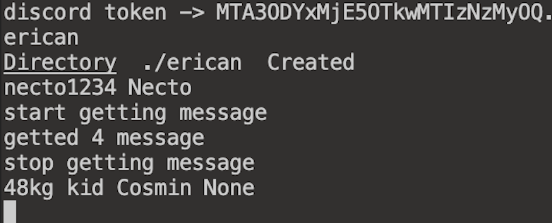
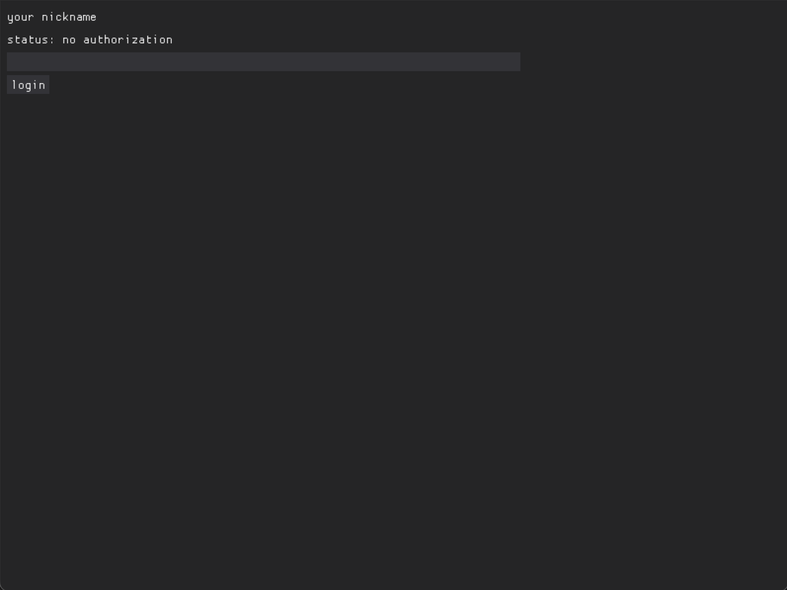
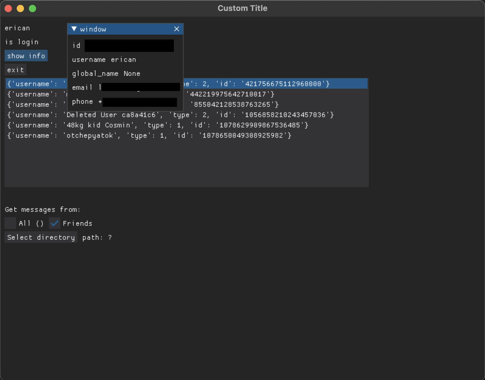

# DM-discord-scraper

Is an application for archiving all messages from DM Discord

recording format from DM in json:
```
username.json

{
    "info": {
        "id": "",
        "username": "",
        "global_name": "",
        "avatar": "",
        "discriminator": "",
        "public_flags": 0,
        "flags": 0,
        "banner": null,
        "banner_color": null,
        "accent_color": null,
        "bio": "",
        "avatar_decoration": null
    },
    "messages": [
        {
            "author": "",
            "time": "",
            "content": ""
        },
        {
            "author": "",
            "time": "",
            "content": ""
        },
    ]
}
```

## run console: 
```
python3 -m pip install requests

python3 main.py
```




## run gui:
```
python3 -m pip install requests dearpygui

python3 gui.py
```

